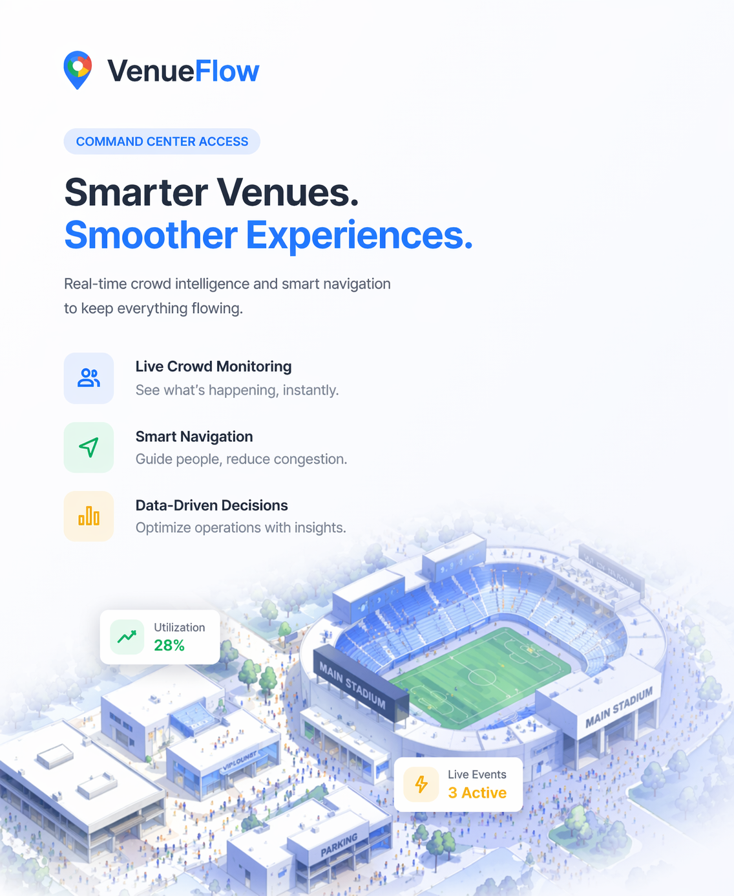

<p align="center">
  
</p>

<h1 align="center">VenueFlow</h1>
<p align="center"><strong>AI-Powered Smart Venue Command Center</strong></p>
<p align="center">Real-time crowd intelligence, predictive analytics, and operational decision support for large-scale sporting venues.</p>

<p align="center">
  
  
  
  
  
</p>

---

## The Problem

50,000 fans. One stadium. Halftime hits — everyone wants food at the same time. Gates bottleneck. Concourses overflow. Fans miss the action waiting in lines they didn't need to be in.

Large-scale sporting venues face a fundamental coordination problem: **thousands of people making independent decisions in a shared physical space, with no real-time intelligence to guide them.**

Current solutions are reactive — staff responds to problems after they've already formed.

## The Solution

**VenueFlow** transforms venue operations from reactive firefighting into **proactive decision-making**.

It's a real-time command center that monitors crowd density across every zone, predicts congestion before it forms, and recommends specific operational actions — complete with projected impact.

### Example in Action

> The system detects Food Court A is filling at +8 people/minute. It calculates the zone will hit critical capacity in ~12 minutes. It immediately suggests:
>
> 1. **Reroute foot traffic** from Food Court A to Food Court B (currently at 0% vs 36%)
> 2. **Deploy mobile food carts** to South Concourse (has capacity for overflow)
> 3. **Send push notification** to attendees: "Skip the line — Food Court B has shorter wait"
>
> The operator clicks "Simulate" to see projected impact, then executes.

---

## Features

### 🧠 Intelligence Engine
- **Predictive congestion alerts** with specific ETAs ("Food Court A will hit capacity in ~12 min")
- **Smart rerouting suggestions** that identify underutilized alternatives
- **Incoming surge predictions** based on upcoming event schedules
- **Dynamic observations** about venue-wide patterns
- Auto-refreshes every 5 seconds

### 🗺️ Live Venue Map
- Interactive SVG map with **15 distinct zones** (stadium, concourses, gates, food courts, parking, facilities)
- Real-time **crowd density heatmap** (Low → Moderate → High → Critical)
- Hover tooltips showing occupancy, capacity, and percentage
- Animated pathfinding with start/end markers

### 📊 3-Column Command Center Dashboard
- **Left panel** (dark, sticky): Operational status, quick stats, live alerts feed
- **Center column** (scrollable): Smart insights, venue map, bottleneck detection, movement flow, event phases, suggested actions with simulation
- **Right panel** (sticky): KPI cards with sparkline trend charts
- Responsive — collapses to single column with mobile summary bar on small screens

### 🚶 Crowd-Aware Navigation
- **Dijkstra's shortest path** algorithm across the venue graph
- **Crowd-adjusted walk times** — adds delay for congested zones
- Step-by-step directions with per-zone crowd status
- Route warnings when passing through high-density areas

### 🎫 Interactive Event Management
- 8 pre-loaded demo events (5 live, 3 upcoming) with realistic attendee data
- **Join Event** and **Exit Event** with real-time capacity updates
- **Join & Navigate** — enters the event and routes you there
- **Exit & Find Route** — leaves and opens navigation from that zone
- **User awareness** — tracks which zone you're in, highlights it on the map
- Crowd status indicators (Smooth / Moderate / Busy / Congested)
- Expanded details: crowd trend prediction, nearby facilities, entry/exit suggestions

### ⚠️ Bottleneck Detection
- Identifies zones with high occupancy or rapid filling
- **Entry/exit flow rates** per zone (people per minute)
- **Flow direction indicators** (▲ Filling / ▼ Draining / ● Stable)
- Severity classification (Critical / High / Moderate)

### 💡 Suggested Actions with Simulation
- Prioritized operational recommendations (High / Medium / Low)
- Four action types: **Staffing**, **Routing**, **Operations**, **Communication**
- Each includes: action, reason, and projected impact
- **"Simulate Recommendations"** button to model outcomes

### 📈 Analytics Dashboard
- Overall venue capacity gauge
- Zone utilization breakdown
- Event attendance comparison
- Zone type breakdown with emoji categories

### 🔐 Role-Based Access Control
- Enterprise-style access gate at `/`
- Multiple access levels:

| Access ID | Role | Level | Admin Access |
|-----------|------|-------|:------------:|
| `DEMO-ACCESS` | Demo User | Demo | ❌ |
| `STAFF-ALPHA` | Staff | Staff | ❌ |
| `VENUE-OPS-001` | Operations | Admin | ✅ |
| `ADMIN-2026` | Administrator | Admin | ✅ |
| `SUPERADMIN` | Super Admin | Super Admin | ✅ |

- Session persistence via localStorage
- Role badge in navbar
- "Exit Session" button to logout

### ⚙️ Admin Dashboard (`/admin`)
- **Full event management**: Create, edit, delete events with emoji picker, zone selector, capacity, status, and scheduling
- **Zone configuration**: Edit zone names, capacities, and types
- **Table view** for events with inline status badges and capacity bars
- **Card grid** for zones with occupancy visualization
- Modal-based forms with validation
- All changes reflect immediately across the entire application
- Only accessible to Admin and Super Admin roles

### 🔔 Real-Time Alerts
- Auto-generated when zones hit High or Critical crowd levels
- Categorized: Danger / Warning / Info / Success
- Relative timestamps ("5m ago", "2h ago")
- Unread count badge in navbar

---

## Architecture

```
┌─────────────────────────────────────────────────────┐
│                    Frontend (React)                  │
│  ┌──────────┐  ┌──────────┐  ┌───────────────────┐  │
│  │ Firebase  │  │  REST    │  │   Intelligence    │  │
│  │ Realtime  │  │  API     │  │   Polling (5s)    │  │
│  │ Listeners │  │  Client  │  │                   │  │
│  └─────┬─────┘  └─────┬────┘  └────────┬──────────┘  │
└────────┼──────────────┼────────────────┼─────────────┘
         │              │                │
         ▼              ▼                ▼
┌─────────────────────────────────────────────────────┐
│              Backend (Node.js + Express)             │
│  ┌──────────┐  ┌──────────┐  ┌───────────────────┐  │
│  │  Events   │  │  Zones   │  │   Intelligence    │  │
│  │  CRUD     │  │  CRUD    │  │   Engine          │  │
│  ├──────────┤  ├──────────┤  ├───────────────────┤  │
│  │Navigation │  │Analytics │  │  Admin Routes     │  │
│  │  Routes   │  │  Routes  │  │  Alert Routes     │  │
│  └─────┬─────┘  └─────┬────┘  └────────┬──────────┘  │
└────────┼──────────────┼────────────────┼─────────────┘
         │              │                │
         ▼              ▼                ▼
┌─────────────────────────────────────────────────────┐
│           Firebase Firestore / In-Memory Store       │
│         (Real-time sync / Demo mode fallback)        │
└─────────────────────────────────────────────────────┘
```

**Hybrid approach:**
- **Firebase Firestore** for real-time data synchronization (when configured)
- **In-memory demo store** for zero-config demo mode
- **Node.js backend** handles all business logic: crowd calculations, pathfinding, intelligence engine, admin CRUD, alert generation
- **Frontend** reads real-time via Firebase listeners OR polls the backend API

---

## Tech Stack

| Layer | Technology | Purpose |
|-------|-----------|---------|
| Frontend | React 18, Vite 5 | SPA with component architecture |
| Styling | Tailwind CSS 3.4 | Google-themed design system |
| Icons | Lucide React | Consistent icon library |
| Routing | React Router 6 | Client-side navigation + auth guards |
| Backend | Node.js 20, Express | REST API + business logic |
| Database | Firebase Firestore | Real-time data sync |
| Intelligence | Custom engine | Predictions, bottlenecks, suggestions |
| Pathfinding | Dijkstra's algorithm | Crowd-aware shortest path |
| Deployment | Google Cloud Run | Serverless container hosting |
| Container | Docker (multi-stage) | Production build |

---

## Getting Started

### Prerequisites
- Node.js 20+
- npm

### Quick Start (Demo Mode)

```bash
# Clone the repo
git clone <your-repo-url>
cd venueflow

# Install dependencies
cd backend && npm install
cd ../frontend && npm install

# Start backend (port 4000)
cd ../backend && npm start

# Start frontend (port 3000) — in another terminal
cd ../frontend && npm run dev
```

Open `http://localhost:3000`

- Enter `DEMO-ACCESS` to explore as a regular user
- Enter `ADMIN-2026` to access the Admin Dashboard

### Deploy to Google Cloud Run

```bash
gcloud run deploy venueflow \
  --source . \
  --region us-central1 \
  --allow-unauthenticated \
  --port 8080
```

---

## Project Structure

```
├── backend/
│   ├── server.js              # Express server + static file serving
│   ├── intelligence.js        # Predictive intelligence engine
│   ├── demoStore.js           # In-memory store + admin CRUD
│   ├── venueData.js           # Venue zones + seed events (8 events)
│   ├── firebaseAdmin.js       # Firebase Admin SDK setup
│   ├── seed.js                # Firestore seeder
│   └── routes/
│       ├── demo.js            # All routes: events, zones, nav, admin CRUD
│       ├── events.js          # Firebase event routes
│       ├── zones.js           # Firebase zone routes
│       ├── navigation.js      # Pathfinding + crowd routing
│       ├── analytics.js       # Computed analytics
│       └── alerts.js          # Alert management
├── frontend/
│   ├── public/
│   │   └── venue_app.png      # Login page illustration
│   ├── vite.config.js         # Dev proxy (/api → localhost:4000)
│   └── src/
│       ├── App.jsx            # Auth routing + protected routes
│       ├── main.jsx           # Entry point with AuthProvider
│       ├── components/
│       │   ├── Navbar.jsx     # Nav + role badge + admin link + logout
│       │   └── VenueMap.jsx   # Interactive SVG venue map
│       ├── pages/
│       │   ├── AccessGate.jsx # Login page with illustration
│       │   ├── Dashboard.jsx  # 3-column command center
│       │   ├── Events.jsx     # Interactive event management
│       │   ├── Navigation.jsx # Crowd-aware pathfinding
│       │   ├── Analytics.jsx  # Venue analytics
│       │   ├── Alerts.jsx     # Alert feed
│       │   └── Admin.jsx      # Admin dashboard (events + zones CRUD)
│       └── lib/
│           ├── api.js         # Backend API client (inc. admin endpoints)
│           ├── auth.jsx       # Auth context + role-based access
│           ├── firebase.js    # Firebase client config
│           ├── realtimeService.js # Real-time subscriptions
│           └── venueData.js   # Static venue layout data
├── Dockerfile                 # Multi-stage production build
├── .dockerignore
└── README.md
```

---

## Key Design Decisions

1. **Hybrid Firebase + Node.js** — Firebase for real-time reads, Node.js for business logic and admin operations
2. **Intelligence engine on the backend** — Predictions computed server-side with specific ETAs and rerouting suggestions
3. **Demo mode by default** — Works out of the box with 8 pre-loaded events and 15 zones, zero configuration
4. **Single container deployment** — Backend serves frontend build. One Dockerfile, one Cloud Run service
5. **Role-based access** — Demo users see the operational view, admins get full CRUD control
6. **Vite dev proxy** — `/api` routes proxy to backend in development, same-origin in production. No environment variables needed
7. **Admin changes reflect instantly** — Same in-memory store powers both the public dashboard and admin panel

---

## Demo Data

The application comes pre-loaded with:

**8 Events** (5 live, 3 upcoming):
| Event | Zone | Status | Attendees |
|-------|------|--------|-----------|
| ⚽ Championship Finals | Main Stadium | Live | 3,420 / 5,000 |
| 🍔 Food Festival | Food Court A | Live | 287 / 600 |
| �️ Fan Merch Drop | Merchandise Store | Live | 156 / 300 |
| ⭐ VIP Meet & Greet | East Wing | Live | 142 / 200 |
| 🎪 Kids Fun Zone | West Wing | Live | 213 / 500 |
| 🏀 Basketball Semifinals | Main Stadium | Upcoming | 0 / 4,500 |
| 🎾 Tennis Exhibition | South Concourse | Upcoming | 0 / 1,500 |
| 🎵 Live Concert | South Concourse | Upcoming | 0 / 1,800 |

**15 Venue Zones**: Main Stadium, North/South Concourse, East/West Wing, Food Court A/B, Merchandise Store, First Aid, Parking East/West, Gates 1-4

**7 Alerts**: Mix of danger, warning, info, and success notifications

---

## Live Demo

🔗 **[your-cloud-run-url]**

| Try as | Access ID | What you see |
|--------|-----------|-------------|
| Regular user | `DEMO-ACCESS` | Dashboard, events, navigation, analytics |
| Admin | `ADMIN-2026` | Everything above + Admin panel to manage events & zones |

---

<p align="center">
  Built for the <strong>Prompt Wars Challenge</strong> by <strong>Hack2Skill</strong>
</p>
